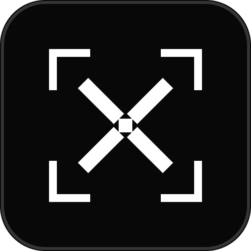
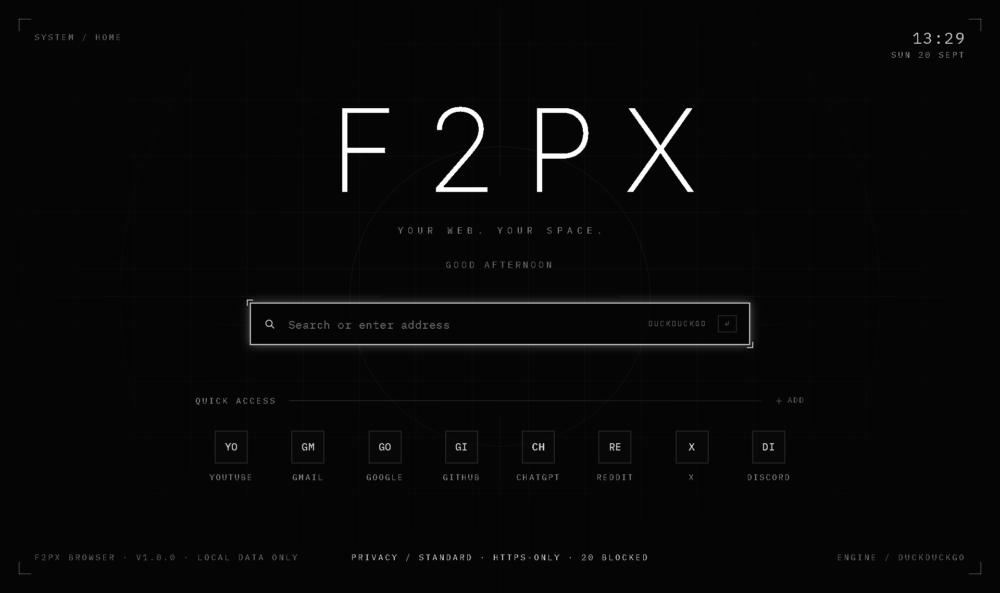
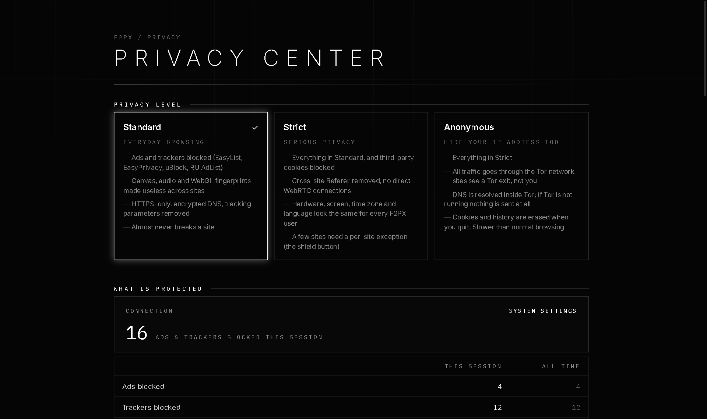
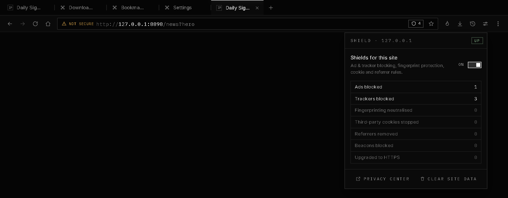
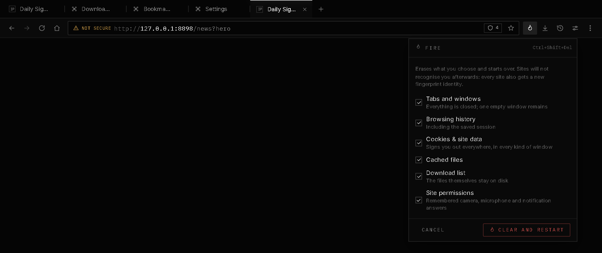
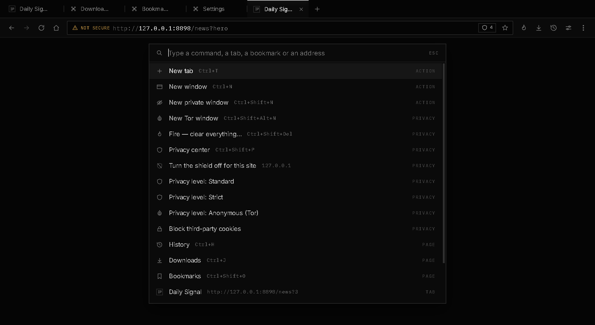
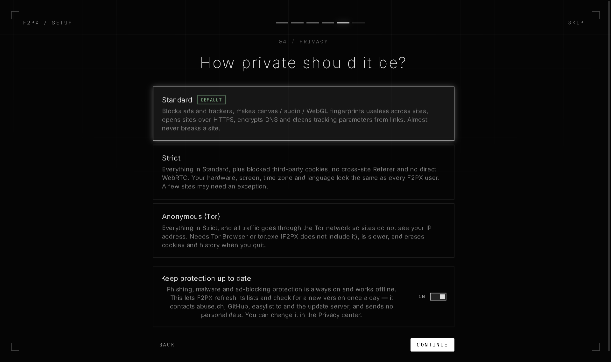
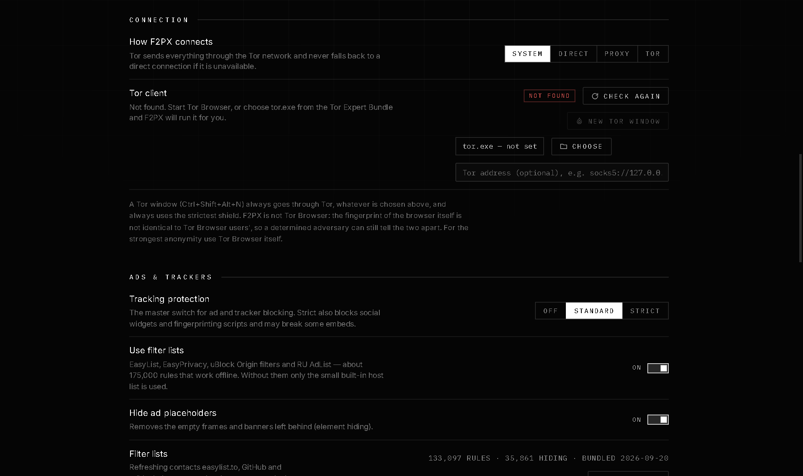
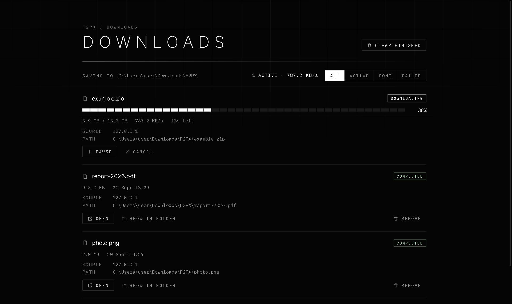

<div align="center">



# F2PX Browser

**Your web. Your space.**
A minimalist, futuristic, **privacy-first** browser for Windows 10/11 — built on Electron + Chromium, React and TypeScript.

[](https://github.com/StuckStudd/f2px-Browserr/releases)
[](https://www.electronjs.org/)
[](https://www.typescriptlang.org/)
[](#privacy-you-can-verify)
[](#testing)
[](package.json)

[**Download**](https://github.com/StuckStudd/f2px-Browserr/releases) · [Website](website/README.md) · [Changelog](CHANGELOG.md) · [Русская версия](README.ru.md)

<br />



</div>

---

## Why F2PX

* **Private by default.** Ads and trackers are blocked with real filter lists, fingerprinting is neutralised, HTTPS is the default, DNS is encrypted, and the app sends **nothing** to any server of its own — a test proves it.
* **Anonymity when you need it.** One click to a Tor window, an *Anonymous* level that routes everything through Tor, and a **Fire** button (`Ctrl+Shift+Del`) that erases everything and gives every site a new identity. If Tor is not available, nothing is ever sent directly.
* **A real, fast browser.** Every tab is a real Chromium `WebContentsView`; the interface is thin lines, monospace type and lots of empty space.

<div align="center">

</div>

## Screenshots

<table>
  <tr>
    <td width="50%"><br /><sub><b>Site shield</b> — what was blocked on this page, per-site switches</sub></td>
    <td width="50%"><br /><sub><b>Fire</b> — erase everything and start over</sub></td>
  </tr>
  <tr>
    <td width="50%"><br /><sub><b>Command palette</b> — <code>Ctrl+Shift+K</code>: commands, tabs, bookmarks, history</sub></td>
    <td width="50%"><br /><sub><b>First run</b> — choose Standard, Strict or Anonymous</sub></td>
  </tr>
  <tr>
    <td width="50%"><br /><sub><b>Connection</b> — System, Direct, Proxy or Tor</sub></td>
    <td width="50%"><br /><sub><b>Downloads</b> — progress, speed, pause / resume</sub></td>
  </tr>
</table>

## Privacy levels

Three ready-made bundles of the fine-grained settings. Pick one in the first-run wizard, in *Settings → Privacy* or in the Privacy center (`Ctrl+Shift+P`); anything you change by hand becomes *Custom*.

| | **Standard** *(default)* | **Strict** | **Anonymous** |
| --- | :---: | :---: | :---: |
| Ads & trackers blocked (filter lists + built-in list) | ✅ | ✅ *(also social widgets)* | ✅ |
| Canvas / audio / WebGL fingerprints neutralised | ✅ | ✅ | ✅ |
| HTTPS-only · encrypted DNS · tracking parameters removed | ✅ | ✅ | ✅ *(DNS strict)* |
| Third-party cookies blocked | – | ✅ | ✅ |
| Cross-site `Referer` removed · no direct WebRTC | – | ✅ | ✅ |
| Same hardware / screen / time zone (UTC) / language (en-US) as every F2PX user | – | ✅ | ✅ |
| Public sites cannot reach `localhost` / your LAN | – | ✅ | ✅ |
| All traffic through **Tor** (fail-closed) | – | – | ✅ |
| Cookies and history erased on exit | – | – | ✅ |

## Privacy you can verify

| What | How it works |
| --- | --- |
| **No traffic of its own** | No telemetry, no sync. List updates and the update check are **off** by default. `tests/e2e/06-no-background-traffic.mjs` runs the browser behind a logging proxy for 30 s and asserts that not a single request is made. |
| **Ad & tracker blocking** | EasyList, EasyPrivacy, uBlock Origin (filters, privacy, badware, unbreak) and RU AdList — about **175,000 rules** parsed by a built-in engine (host-anchored and token indexing, ~0.07 ms per request). Network rules with `$third-party`, resource types, `$domain`, `@@` exceptions, plus element hiding. Bundled offline; refreshed only when you ask (or opt in to daily updates). |
| **Fingerprint protection** | Runs in **every frame** (including third-party and blank iframes, the classic bypass). Canvas, audio and WebGL reads get noise that is different per site and per session but stable inside a site — nothing breaks, and trackers cannot link you across sites. The GPU model is not exposed. Strict adds uniform hardware, screen, UTC time zone, en-US language and removes Battery / Network Information / device and voice lists. Patched functions still look native. |
| **Cookies & referrers** | Third-party `Cookie` / `Set-Cookie` are stripped (and `document.cookie` is empty in embedded third-party frames); cross-site `Referer` and `document.referrer` are removed; high-entropy Client Hints are not sent. Per-site exceptions live in the shield button. |
| **Tor & proxies** | F2PX does **not** bundle Tor. It finds a running Tor Browser (`127.0.0.1:9150`) or `tor` (`9050`), or starts a `tor.exe` you point it to. Hostnames are handed to the proxy **unresolved** (no DNS leak) and if Tor is down you get an error page — never a direct connection. Icons, list updates and update checks use the same route. |
| **Fire** | `Ctrl+Shift+Del` closes windows and erases history, session, cookies and storage (normal, private **and** Tor windows), cache, download list and permissions, and rotates the fingerprint identity. |
| **UI without network** | The browser interface never loads anything from the internet: site icons are fetched by the main process through the window's own route (no cookies, no Referer, size-capped) and the shell session blocks all external requests. |
| **Local encryption** | History, bookmarks, settings, downloads and session live in `f2px.vault` (AES-256-GCM). The key is protected by Windows DPAPI or an optional start-up password (scrypt). No plaintext copies. |
| **Phishing & malware** | Offline list of ~387,000 dangerous hosts (URLhaus + Phishing.Database, matched by 53-bit hashes) plus look-alike address heuristics (`paypa1.com`, mixed alphabets). Navigation stops *before* the page loads. |
| **Downloads** | Every file gets the Mark-of-the-Web (`Zone.Identifier`), disguised executables (`invoice.pdf.exe`) are flagged and launching programs needs confirmation. |
| **Permissions** | Camera, microphone and notifications are asked per site (optionally remembered; forgotten on close in private and Tor windows). Geolocation, USB, serial, HID and Bluetooth are never offered. |

## Features

* **Tabs** — pin, drag, restore closed (`Ctrl+Shift+T`), mute, middle-click / `Ctrl`-click, adaptive density, session restore with lazy loading.
* **Omnibox** — URL or search (DuckDuckGo, Brave, Startpage, Qwant, Mojeek, Google, Bing), suggestions from bookmarks, history and top sites.
* **Command palette** (`Ctrl+Shift+K`) and tab search (`Ctrl+Shift+A`) · **Save as PDF** · **Screenshot**.
* **Start page** — search, Quick Access (add / rename / reorder), clock, greeting, custom background and accent.
* **Downloads** — real progress, speed, ETA, pause / resume / cancel / retry, per-download source and path.
* **History & bookmarks** — search, grouping, folders, drag & drop, import / export (Netscape HTML from Chrome, Edge, Firefox), bookmarks bar.
* **Private windows** — separate in-memory session, wiped when the last one closes. **Tor windows** on top of that.
* **Custom error pages** — offline (auto-retry), DNS, crash, certificate, HTTPS-only, dangerous site, proxy / Tor.
* **Windows integration** — native window controls (Snap Layouts), tray, autostart, GPU-acceleration switch, Dark / Light / System theme.

## Quick start

```bash
npm install          # dependencies (no native modules — SQLite ships inside Electron's Node)
npm run dev          # development mode with HMR
npm run build        # type check + build to out/
npm run dist         # Windows installer and portable build in release/
```

After `npm run dist`, `release/` contains:

| File | What it is |
| --- | --- |
| `F2PX-Browser-Setup.exe` | NSIS installer (per user, choose folder, shortcuts) |
| `F2PX-Browser.exe` | portable build — double-click to run |
| `win-unpacked/` | unpacked app (`npm run dist:dir`) |

> The installer is **not code-signed**, so Windows SmartScreen may show a warning ("More info → Run anyway"). For a public release buy an OV/EV code-signing certificate and set `CSC_LINK` (path to `.pfx` or base64) and `CSC_KEY_PASSWORD` before `npm run dist`; electron-builder then signs the installer and `F2PX-Browser.exe` automatically. A self-signed certificate does not remove the warning.

If you run `npm run dev` from a VS Code / Claude Code terminal, the `ELECTRON_RUN_AS_NODE=1` variable breaks Electron — `scripts/run.cjs` resets it for you.

Filter lists and the threat list ship with the repo. To rebuild them: `npm run filters:update` and `npm run threats:update`.

## Keyboard shortcuts

| Shortcut | Action | Shortcut | Action |
| --- | --- | --- | --- |
| `Ctrl+T` | New tab | `Ctrl+N` | New window |
| `Ctrl+W` | Close tab | `Ctrl+Shift+N` | Private window |
| `Ctrl+Shift+T` | Reopen closed tab | `Ctrl+Shift+Alt+N` | **Tor window** |
| `Ctrl+Tab` / `Ctrl+Shift+Tab` | Next / previous tab | `Ctrl+Shift+Del` | **Fire** |
| `Ctrl+L` | Address bar | `Ctrl+Shift+P` | **Privacy center** |
| `Ctrl+D` | Bookmark | `Ctrl+Shift+K` | **Command palette** |
| `Ctrl+H` / `Ctrl+J` | History / Downloads | `Ctrl+Shift+A` | Search tabs |
| `Ctrl+F` | Find in page | `Alt+←` / `Alt+→` | Back / Forward |
| `Ctrl+R` / `F5` | Reload | `Ctrl+Shift+R` | Hard reload |
| `Ctrl+1…9` | Tab by number | `F12` | DevTools |

The full list is in *Settings → Shortcuts*.

## Architecture

```
src/
  main/                 Electron main process (Node)
    browser/            windows, tabs, omnibox, context menu, f2px:// protocol, session policy, page emulation
    downloads/          DownloadManager (pause/resume/cancel/retry, speed, notifications, Mark-of-the-Web)
    network/            route (system / direct / proxy / Tor, fail-closed), TorService, main-process fetch, site icons
    privacy/            filter engine + lists, PrivacyGuard (requests), page shield service, per-session policy, site rules
    history/ bookmarks/ quickaccess/ settings/   data services
    storage/            encrypted vault + SQLite (node:sqlite) + migrations
    ipc/                typed RPC, event hub
    system/             tray, update notification
  preload/              index.ts — sandboxed RPC bridge · shield.ts + shieldMain.ts — page shield in every frame
  shared/               types, IPC contract, URL parsing, shortcuts, privacy levels
  renderer/
    shell/              browser UI: tabs, toolbar, omnibox, shield & Fire popups, command palette
    pages/              f2px://home | history | downloads | bookmarks | settings | privacy | error
    components/ hooks/ lib/ styles/
scripts/                launcher, icon generator, filter / threat list builders, site helpers
website/                static download site (RU / EN) — see website/README.md
tests/                  unit + end-to-end tests (see below)
```

**Window layout.** A frameless `BrowserWindow` hosts a transparent `WebContentsView` for the React shell (normally only the top strip) and one `WebContentsView` per tab. When a menu or popup opens, the main process stretches the shell over the whole window so it renders above the page.

**Internal pages** (`f2px://history`, …) are one React app served by a custom protocol. They get the `window.f2px` bridge only while showing an `f2px://` document.

## Security

* `contextIsolation` and `sandbox` on, no `nodeIntegration` anywhere; strict CSP on internal pages.
* One RPC channel between renderers and the main process: the caller is identified by its `webContents` (never by what it claims), every method declares a scope (`shell` / `page` / `both`), and `f2px://` pages are trusted only while their main frame is `f2px://`.
* Web pages cannot see the bridge or navigate to `f2px://`, `file://` or `javascript:`; `mailto:` / `tel:` need confirmation.
* Certificate errors block the page; "proceed" is remembered per host until the app closes.
* Filter lists cannot inject anything into pages: element-hiding selectors are validated and catastrophic regular expressions are refused.

Found a vulnerability? Please read [SECURITY.md](SECURITY.md).

## Testing

```bash
npm run typecheck
npm run test:unit                      # URL parsing, shortcuts, bookmarks, threat list, filter engine,
                                       # privacy levels, session policy, route / Tor fail-closed, site rules, icons
npm run build && npm run test:e2e      # starts the real app and drives it over CDP (needs a Windows desktop)
```

The end-to-end suites cover navigation, tabs, downloads, history, bookmarks, settings, sessions, hotkeys, drag & drop, private mode, error pages, page isolation — and the privacy stack: filter lists and element hiding, fingerprint protection inside iframes, cookies, `Referer`, Fire (`09-shield`), a local SOCKS5 proxy with a DNS-leak check, fail-closed Tor and Tor windows (`10-network`), and the shield / Fire / Privacy-center / command-palette UI (`11-privacy-ui`).

## Honest limits

* F2PX is **not Tor Browser**. Your IP is hidden only in Tor mode (or behind your own proxy / VPN). Fingerprint protection makes you hard to *follow* between sites, not identical to everyone: fonts, exact window geometry and GPU behaviour still differ a little.
* Tor is not included — you need Tor Browser or `tor.exe` (Tor Expert Bundle).
* The filter engine understands the main EasyList / uBlock rules, but not scriptlets or response rewriting (for example it cannot skip YouTube ads).
* **Strict** can make some sites ask for a captcha or misbehave; use the shield button to add an exception for that site.
* There is deliberately **no password manager** (browser password stores are the favourite malware target) — use Bitwarden or KeePassXC.
* No DRM (Widevine) and no Chrome extensions; no sync between devices. The installer is unsigned.
* Chromium inside F2PX is updated only by rebuilding on a newer Electron.
* "Chrome compatibility" (needed for Google sign-in) reports the browser as Chrome; switch it off in *Settings → Privacy* if you don't need it.

## Contributing

Issues and pull requests are welcome — see [CONTRIBUTING.md](CONTRIBUTING.md). Please run `npm test` (and `npm run test:e2e` if you touch behaviour) before opening a PR.

## Credits & licence

F2PX is released under the **MIT** licence. The bundled filter lists and threat list are third-party **data** under their own licences — see [THIRD_PARTY_NOTICES.md](THIRD_PARTY_NOTICES.md). Built with [Electron](https://www.electronjs.org/), [React](https://react.dev/), [Vite](https://vitejs.dev/), IBM Plex Mono and Inter.
